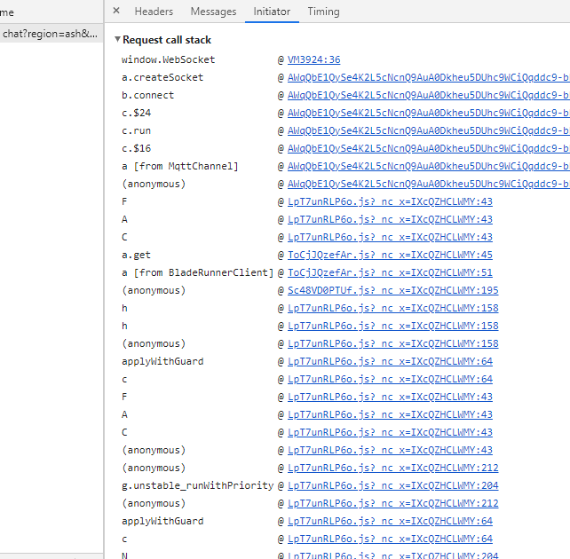
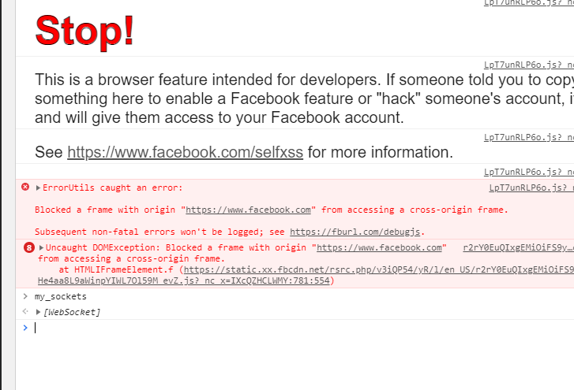

<style>
html { display: flex; justify-content: center }
table { width: 100% }
td, th { border: inset; padding: 0.2em }
body { width: 32em }
pre, code { background-color: #eee }
pre { overflow: scroll; padding: 1em }
img, video { width: 100% }
</style>

# experiment: inject facebook messenger to steal its WebSocket
facebook stickers are slow to open and send, especially on web version.

so i wondered how i could tinker with web version to allow programmatic control of sending stickers, instead of having to manually click stuff.

## first thoughts: maybe its just html request
often a web app handles something like sending a sticker with a HTML POST request or something

and then we can just imitate the kind of requests that the web app makes in order to achieve same thing

html requests are used for a ton of other stuff also so i am used to them so i hoped that facebook messenger would send a sticker with this common method. oh, but they did not. when you click to send a sticker, it does not make a HTML request.

they actually use newer technology called 'WebSocket'

do you know what a socket is? I personally struggled with concept for a long time because i never actually did much work with them. a socket is basically like a hole you can shove stuff down to send it to server, and stuff magically falls out which is from server.

a socket is often used with things like a messaging, because things can fall out of the hole as they please. so if you are messaging someone, their messages come instantly. if you try to make a messaging with HTML requests, you would have to constantly request server: 'did i get any new message yet?'

I am not quite comfortable with socket, WebSocket. so i will think maybe i can send without socket?

## second thoughts: maybe programmatically click on buttons to send stickers
in javascript, DOM elements have `.click()` method you can call and it clicks them.

so maybe i could select the sticker button and click it..

well it turns out that this is not possible because you have to click the sticker menu FIRST, then click a sticker button within the menu.

and the menu isn't just hidden or something, it is actually removed from dom when it is not active

<video controls src=sticker-menu.mp4></video>

so to programmatically click sticker button, i would have to somehow programatically
1. click sticker menu
2. somehow know when sticker menu opened
3. navigate horrible menu selection to correct page
4. finally click the sticker button

it is just big headache. so i guess i will just have to conquer sockets..

## WebSocket
well socket it is..

chrome dev tools have a tool for viewing a websocket

<video controls src=first-look-websocket.mp4></video>

to the right is the tool; it shows whats going on with ur socket..

things that came from server in white, things that you send to server in green..

as you can see, there is a ton of stuff.. and it goes flying when you send sticker!!

well we need to understand what is sending in order to also send sticker..

as you can see, they all say 'binary message'. this means that it is just any arbitrary data being sent, not particularly ascii/utf-8 encoded text!!

the chrome tool decides to display the 'binary message' in base64 format, which imo not very convenient.. so i constantly used base64 to either ascii or hexadecimal convertor for viewing..

well we want to see what facebook messenger is tossing down the hole that corresponds to sending a sticker.. so i lets look at some of what its sending..

here is a 2B (2-byte) binary data..
```
base64: wAA=
hex: c0 00
ascii: À
```

well it is probably not what we are looking for.. it is probably just some reoccuring protocol message..

heres a 167B one..
```
base64: MKQBAAcvbHNfcmVxeyJyZXF1ZXN0X2lkIjo3MiwidHlwZSI6NCwicGF5bG9hZCI6IntcImxhYmVsXCI6XCIxXCIsXCJwYXlsb2FkXCI6XCJ7XFxcImFwcF9zdGF0ZVxcXCI6MH1cIixcInZlcnNpb25cIjpcIjQxNDg1NzcyNDUyNjQ0ODFcIn0iLCJhcHBfaWQiOiIyMjIwMzkxNzg4MjAwODkyIn0=
hex: 30 a4 01 00 07 2f 6c 73 5f 72 65 71 7b 22 72 65 71 75 65 73 74 5f 69 64 22 3a 37 32 2c 22 74 79 70 65 22 3a 34 2c 22 70 61 79 6c 6f 61 64 22 3a 22 7b 5c 22 6c 61 62 65 6c 5c 22 3a 5c 22 31 5c 22 2c 5c 22 70 61 79 6c 6f 61 64 5c 22 3a 5c 22 7b 5c 5c 5c 22 61 70 70 5f 73 74 61 74 65 5c 5c 5c 22 3a 30 7d 5c 22 2c 5c 22 76 65 72 73 69 6f 6e 5c 22 3a 5c 22 34 31 34 38 35 37 37 32 34 35 32 36 34 34 38 31 5c 22 7d 22 2c 22 61 70 70 5f 69 64 22 3a 22 32 32 32 30 33 39 31 37 38 38 32 30 30 38 39 32 22 7d
ascii: 0¤/ls_req{"request_id":72,"type":4,"payload":"{\"label\":\"1\",\"payload\":\"{\\\"app_state\\\":0}\",\"version\":\"4148577245264481\"}","app_id":"2220391788200892"}
```

oh hmm.. well based on ascii it is some kind of json message.. but it doesnt seem to have to do with stickers.. lets look more..

heres a 627B one..
```
base64: MvoEAAcvbHNfcmVxAKl7InJlcXVlc3RfaWQiOjcxLCJ0eXBlIjozLCJwYXlsb2FkIjoie1widmVyc2lvbl9pZFwiOlwiNDE0ODU3NzI0NTI2NDQ4MVwiLFwidGFza3NcIjpbe1wibGFiZWxcIjpcIjQ2XCIsXCJwYXlsb2FkXCI6XCJ7XFxcInRocmVhZF9pZFxcXCI6MTAwMDU5OTE0MDkxMjg0LFxcXCJvdGlkXFxcIjpcXFwiNjc3NDU3NDE0MDY5OTg5NjA2MVxcXCIsXFxcInNvdXJjZVxcXCI6NjU1MzcsXFxcInNlbmRfdHlwZVxcXCI6MixcXFwic3RpY2tlcl9pZFxcXCI6MTkyNjIzNzE5NzQxNTI3NH1cIixcInF1ZXVlX25hbWVcIjpcIjEwMDA1OTkxNDA5MTI4NFwiLFwidGFza19pZFwiOjc3LFwiZmFpbHVyZV9jb3VudFwiOm51bGx9LHtcImxhYmVsXCI6XCIyMVwiLFwicGF5bG9hZFwiOlwie1xcXCJ0aHJlYWRfaWRcXFwiOjEwMDA1OTkxNDA5MTI4NCxcXFwibGFzdF9yZWFkX3dhdGVybWFya190c1xcXCI6MTYxNTE4NDM0MDY0M31cIixcInF1ZXVlX25hbWVcIjpcIjEwMDA1OTkxNDA5MTI4NFwiLFwidGFza19pZFwiOjc4LFwiZmFpbHVyZV9jb3VudFwiOm51bGx9XSxcImVwb2NoX2lkXCI6Njc3NDU3NDE0MDkxNDE5MDU2NixcImRhdGFfdHJhY2VfaWRcIjpudWxsfSIsImFwcF9pZCI6IjIyMjAzOTE3ODgyMDA4OTIifQ==
hex: 32 fa 04 00 07 2f 6c 73 5f 72 65 71 00 a9 7b 22 72 65 71 75 65 73 74 5f 69 64 22 3a 37 31 2c 22 74 79 70 65 22 3a 33 2c 22 70 61 79 6c 6f 61 64 22 3a 22 7b 5c 22 76 65 72 73 69 6f 6e 5f 69 64 5c 22 3a 5c 22 34 31 34 38 35 37 37 32 34 35 32 36 34 34 38 31 5c 22 2c 5c 22 74 61 73 6b 73 5c 22 3a 5b 7b 5c 22 6c 61 62 65 6c 5c 22 3a 5c 22 34 36 5c 22 2c 5c 22 70 61 79 6c 6f 61 64 5c 22 3a 5c 22 7b 5c 5c 5c 22 74 68 72 65 61 64 5f 69 64 5c 5c 5c 22 3a 31 30 30 30 35 39 39 31 34 30 39 31 32 38 34 2c 5c 5c 5c 22 6f 74 69 64 5c 5c 5c 22 3a 5c 5c 5c 22 36 37 37 34 35 37 34 31 34 30 36 39 39 38 39 36 30 36 31 5c 5c 5c 22 2c 5c 5c 5c 22 73 6f 75 72 63 65 5c 5c 5c 22 3a 36 35 35 33 37 2c 5c 5c 5c 22 73 65 6e 64 5f 74 79 70 65 5c 5c 5c 22 3a 32 2c 5c 5c 5c 22 73 74 69 63 6b 65 72 5f 69 64 5c 5c 5c 22 3a 31 39 32 36 32 33 37 31 39 37 34 31 35 32 37 34 7d 5c 22 2c 5c 22 71 75 65 75 65 5f 6e 61 6d 65 5c 22 3a 5c 22 31 30 30 30 35 39 39 31 34 30 39 31 32 38 34 5c 22 2c 5c 22 74 61 73 6b 5f 69 64 5c 22 3a 37 37 2c 5c 22 66 61 69 6c 75 72 65 5f 63 6f 75 6e 74 5c 22 3a 6e 75 6c 6c 7d 2c 7b 5c 22 6c 61 62 65 6c 5c 22 3a 5c 22 32 31 5c 22 2c 5c 22 70 61 79 6c 6f 61 64 5c 22 3a 5c 22 7b 5c 5c 5c 22 74 68 72 65 61 64 5f 69 64 5c 5c 5c 22 3a 31 30 30 30 35 39 39 31 34 30 39 31 32 38 34 2c 5c 5c 5c 22 6c 61 73 74 5f 72 65 61 64 5f 77 61 74 65 72 6d 61 72 6b 5f 74 73 5c 5c 5c 22 3a 31 36 31 35 31 38 34 33 34 30 36 34 33 7d 5c 22 2c 5c 22 71 75 65 75 65 5f 6e 61 6d 65 5c 22 3a 5c 22 31 30 30 30 35 39 39 31 34 30 39 31 32 38 34 5c 22 2c 5c 22 74 61 73 6b 5f 69 64 5c 22 3a 37 38 2c 5c 22 66 61 69 6c 75 72 65 5f 63 6f 75 6e 74 5c 22 3a 6e 75 6c 6c 7d 5d 2c 5c 22 65 70 6f 63 68 5f 69 64 5c 22 3a 36 37 37 34 35 37 34 31 34 30 39 31 34 31 39 30 35 36 36 2c 5c 22 64 61 74 61 5f 74 72 61 63 65 5f 69 64 5c 22 3a 6e 75 6c 6c 7d 22 2c 22 61 70 70 5f 69 64 22 3a 22 32 32 32 30 33 39 31 37 38 38 32 30 30 38 39 32 22 7d
ascii: 2ú/ls_req©{"request_id":71,"type":3,"payload":"{\"version_id\":\"4148577245264481\",\"tasks\":[{\"label\":\"46\",\"payload\":\"{\\\"thread_id\\\":100059914091284,\\\"otid\\\":\\\"6774574140699896061\\\",\\\"source\\\":65537,\\\"send_type\\\":2,\\\"sticker_id\\\":1926237197415274}\",\"queue_name\":\"100059914091284\",\"task_id\":77,\"failure_count\":null},{\"label\":\"21\",\"payload\":\"{\\\"thread_id\\\":100059914091284,\\\"last_read_watermark_ts\\\":1615184340643}\",\"queue_name\":\"100059914091284\",\"task_id\":78,\"failure_count\":null}],\"epoch_id\":6774574140914190566,\"data_trace_id\":null}","app_id":"2220391788200892"}
```

oh nice..!! this looks exactly what we looking for.. it specifies things like `sticker_id` probably for which sticker to send.. `thread_id` probably for which chat to send the sticker to.. um.. the rest seem kind of weird, but my instinct tells me it is what we will be imitating.. lets dive in deeper..

### oh no the 2ú/ls_req© before the json..
luckily, most of the message is in json which is common format that is human readable so we can sus out the format by reading it..

but before the json there is 2ú/ls_req© in the ascii output.. which means that there is probably some structured packed binary data format..

looking at some other similar messages:

```
2ú/ls_req½{"request_id":74,"type":3,"payload":"{\"version_id\":\"4148577245264481\",\"tasks\":[{\"label\":\"46\",\"payload\":\"{\\\"thread_id\\\":100059914091284,\\\"otid\\\":\\\"6774578056883544177\\\",\\\"source\\\":65537,\\\"send_type\\\":2,\\\"sticker_id\\\":1926238417415152}\",\"queue_name\":\"100059914091284\",\"task_id\":79,\"failure_count\":null},{\"label\":\"21\",\"payload\":\"{\\\"thread_id\\\":100059914091284,\\\"last_read_watermark_ts\\\":1615185274334}\",\"queue_name\":\"100059914091284\",\"task_id\":80,\"failure_count\":null}],\"epoch_id\":6774578057169182469,\"data_trace_id\":null}","app_id":"2220391788200892"}
```

```
2ù/ls_reqÛ{"request_id":87,"type":3,"payload":"{\"version_id\":\"4148577245264481\",\"tasks\":[{\"label\":\"46\",\"payload\":\"{\\\"thread_id\\\":100059914091284,\\\"otid\\\":\\\"6774578476218321670\\\",\\\"source\\\":65537,\\\"send_type\\\":2,\\\"sticker_id\\\":144884805685786}\",\"queue_name\":\"100059914091284\",\"task_id\":89,\"failure_count\":null},{\"label\":\"21\",\"payload\":\"{\\\"thread_id\\\":100059914091284,\\\"last_read_watermark_ts\\\":1615185374312}\",\"queue_name\":\"100059914091284\",\"task_id\":90,\"failure_count\":null}],\"epoch_id\":6774578476417135953,\"data_trace_id\":null}","app_id":"2220391788200892"}
```

oh great.. it changes.. `2ú/ls_req©`, `2ú/ls_req½`, `2ù/ls_reqÛ`.. that means we have to find out what this format is..

### what is the binary data format

so i poke around and find that facebook messenger uses a protocol called MQTT..

well the only way to find out what the format means is to read the protocol specification!!

i will put essential info here but to get full sense, i recommend following along with the [full spec](https://docs.oasis-open.org/mqtt/mqtt/v5.0/os/mqtt-v5.0-os.html)

ok well it says each 'control packet', which basically just means message, begins with a 'fixed header'.. which follows the following format:
<table>
<tr><th>bit</th><th>7</th><th>6</th><th>5</th><th>4</th><th>3</th><th>2</th><th>1</th><th>0</th></tr>
<tr><th>byte 1</th><td colspan=4>control packet type</td><td colspan=4>packet-specific flags</td></tr>
<tr><th>byte 2</th><td colspan=8>remaining length</td></tr>
</table>

ok well.. lets look at our messages.. just the first jumbled ascii garbage like `2ú/ls_req©` parts..

here are three different examples to compare what is same..

```
32 fa 04 00 07 2f 6c 73 5f 72 65 71 00 a9
32 fa 04 00 07 2f 6c 73 5f 72 65 71 00 d1
32 f9 04 00 07 2f 6c 73 5f 72 65 71 00 db
```

#### 'control packet type'

ok so first four bits are control packet type.. which is `3` in ours..

looking at the spec, `3` means it is a 'Publish message' packet.. which makes sense because we are sending a message!!

#### 'packet-specific flags'

ok looking good.. now... the second four bits are flags, which mean different things for different packet types.. for our 'Publish message' packet, the four bits of flags have meaning...

<table>
<tr><th>bit</th><th>3</th><th>2</th><th>1</th><th>0</th></tr>
<tr><th>what is it?</th><td>DUP</td><td colspan=2>QoS</td><td>RETAIN</td></tr>
</table>

oh um... okay??? oh.. it also notes

> DUP = Duplicate delivery of a PUBLISH packet
>
> QoS = PUBLISH Quality of Service
>
> RETAIN = PUBLISH retained message flag

which.. doesnt really give much more sense..

well all of our examples have same flags so maybe not that important? lets move on..

#### remaining length
ok so the next 8 bits/1 byte is remaining length..it is the remaining length of the message..except that it is encoded in 'variable byte integer'...?? so it can actually be more than one byte..

basically, you take your number in binary, chunk it up into 7 bits, and add a single bit in front of each chunk signifying whether ur at the last chunk (0: at last chunk; 1: not at last chunk)

so for one of our examples has 'remaining length' of `f9 04`, which, in binary, is

```
11111001 00000100
```
and surrounding each at-last-chunk?-flag with brackets, we can see

```
[1]1111001 [0]0000100
```
and see that our two 7-bit chunks are `1111001` and `0000100`.. it turns out they are stored in little-endian which means the full number will be the reverse order, so binary `00001001111001`.. which is decimal `633`.. which makes sense, because our messages were just a bit bigger than that size!!

#### whats next
ok whats next on the spec... oh ok a 'variable header'..which is.. variable!!

uh.. i got kinda confused when reading the spec on this.. there were also different versions of the spec, and maybe facebook was using a diff one?? idk.. but basically i just concluded that the rest of the mystery were these bytes

```
ex 1. 00 07 2f 6c 73 5f 72 65 71 00 a9
ex 2. 00 07 2f 6c 73 5f 72 65 71 00 d1
ex 3. 00 07 2f 6c 73 5f 72 65 71 00 db
```

and the only thing changing is the last byte.. which by vaguely skimming spec i assumed was something like some id that should change sometimes? im not sure.. when testing ill just keep it the same and see if it works..

#### and lastly the 'payload'
and the rest of the message is 'payload', the data we want to send.. in our case, it is utf? ascii? encoded json.. okcool..

ok now we are done reading spec that tells us how to format binary data.. now need to know how to format our json so we can change the json to repeatedly send different stickers programmatically..

oh wait but first.. how do we even something down a WebSocket?? how do we get the facebook messenger WebSocket in the first place???

### how to gain access to facebook messengers WebSocket
well how do we send stuff down the websocket in the first place bro..

well we can run javascript on a site with the chrome dev javascript console.. and WebSocket is part of javascript and if we have a websocket like `my_websocket` we can literally just do `my_websocket.send(my_data)`.. but our problem is

*where is the WebSocket???????*

*How do we get it?????*

our only trace of where the websocket is is this html request that initialises the websocket connection.. and if you know how this works you probably already have superpower to send sticker with just your brain..



so i turned to this idea: inject a script into the site before loading which overrides default WebSocket constructor, replacing it with my own constructor that also adds the newly created WebSocket to my secret safekeeping so that we can access it later..

### monkey-patching
this strategy is i think called 'monkey patching' because you are like silly monkey duct taping something to something else patching it up with duct tape creating weird silly mess..

but sometimes like this, the thing you are taping your patch to is such a mess (facebook messenger is mess) that it is the cleanest way to do it..

this is my monkey patch::

```javascript
const my_sockets = []
const super_WebSocket = window.WebSocket

window.WebSocket = function() {
	const sock = new super_WebSocket(...arguments)
	my_sockets.push(sock)
	return sock
}

window.WebSocket.prototype = super_WebSocket.prototype
```

i used chrome extension system to slap it into the page before it loads..

yep!! thats it.. and now we can just access the `my_sockets` variable from chrome dev javascript console..



<video controls src=aces-granted.mp4></video>

to send binary data we just need to pass a `Uint8Array` that contains our bytes into the `my_sockets[0].send`..

### websocket works and we know how to send our json in binary format NOw it is time to understand json

ok its great now we have websocket.. but now we need to know what data in json to send to it..

i tried to just send the same json over and over to send the same sticker.. but it didnt work!! so we need to dive into json to see what we have to change..

heres the json..
```
{"request_id":87,"type":3,"payload":"{\"version_id\":\"4148577245264481\",\"tasks\":[{\"label\":\"46\",\"payload\":\"{\\\"thread_id\\\":100059914091284,\\\"otid\\\":\\\"6774578476218321670\\\",\\\"source\\\":65537,\\\"send_type\\\":2,\\\"sticker_id\\\":144884805685786}\",\"queue_name\":\"100059914091284\",\"task_id\":89,\"failure_count\":null},{\"label\":\"21\",\"payload\":\"{\\\"thread_id\\\":100059914091284,\\\"last_read_watermark_ts\\\":1615185374312}\",\"queue_name\":\"100059914091284\",\"task_id\":90,\"failure_count\":null}],\"epoch_id\":6774578476417135953,\"data_trace_id\":null}","app_id":"2220391788200892"}
```

oh its hard to look at lets 'pretty print' it..

```
{
	"request_id": 87,
	"type": 3,
	"payload": "{\"version_id\":\"4148577245264481\",\"tasks\":[{\"label\":\"46\",\"payload\":\"{\\\"thread_id\\\":100059914091284,\\\"otid\\\":\\\"6774578476218321670\\\",\\\"source\\\":65537,\\\"send_type\\\":2,\\\"sticker_id\\\":144884805685786}\",\"queue_name\":\"100059914091284\",\"task_id\":89,\"failure_count\":null},{\"label\":\"21\",\"payload\":\"{\\\"thread_id\\\":100059914091284,\\\"last_read_watermark_ts\\\":1615185374312}\",\"queue_name\":\"100059914091284\",\"task_id\":90,\"failure_count\":null}],\"epoch_id\":6774578476417135953,\"data_trace_id\":null}",
	"app_id": "2220391788200892"
}
```

ok well its json that contains a string that contains even more json.. kind of disguisting to me..

### a while later

figuring out the format of something like this json is often just changing random stuff and poking around until you find something that works..

that is what i did!! i dont really want to write about it because it was kind of boring

what i found that the only things you really need to change to make facebook messenger process ur message properly are: `epoch_id` and `otid`. both of these have similar-looking example values like `6774578476417135953` and `"6774578476218321670"` (`otid` is a string for some reason).

i have no clue really how these values are generated, but based on past experience, i guessed they are
1. derived from unix epoch somehow
2. you just make them up yourself?

so idk how ur supposed to generate them, but for my solution i took an example `epoch_id` e.g. `6774578476417135953`... then i did `6774578476417135953 / Date.now()` to get some number like `4194141`.. then just multiplied that by calls to `Date.now()` to generate new `epoch_id`s that look similar to example.

so now it is possible to generate json that facebook messenger will receive and process accordingly!!

### putting it all together

so now it is all complete.. to send a sticker we
1. generate json
2. put json into binary format
3. send binary format down websocket
4. success!!!!

## conclusion
in conclusion, we saw that it is possible to get access to socket that facebook uses to send messages. and then we can forge our own messages by imitating the same format. and by doing this we can do stuff like send stickers.

## my code

[here is my code](./writeup-demo.js) it is script to be injected before `https://www.facebook.com/messages/*` loads.

there are just a few extra things it includes that i did not discuss

1. sending text message as well as sticker
	- the two things ended up being very similar i discovered shortly after, so i just made a generalisation when cleaning up code
2. keeping track of current thread
	- i added quick hack that adds an eventlistener to every link that changes chat which stores the new chat's `thread_id` in a variable to be used..

here some example code you could probably run in ur console if using the script

```javascript
// sends a disco sticker to current thread
my_sockets[0].send(b_sticker(curr_thread_id, 2379544618736942))

// sends 'hello world' to current thread
my_sockets[0].send(b_text(curr_thread_id, 'hello world'))
```

## further
oh cool now we know general process of finding out what goes on in websocket to send info. so we could send potentially anything else you can manually send!!!

we could also probably listen to the websocket and like respond to messages or something cool!

the possibilities are endless!!